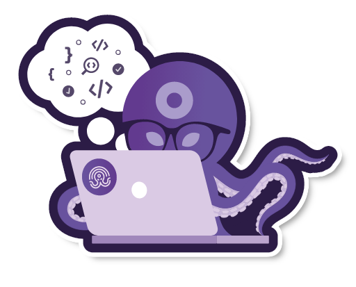
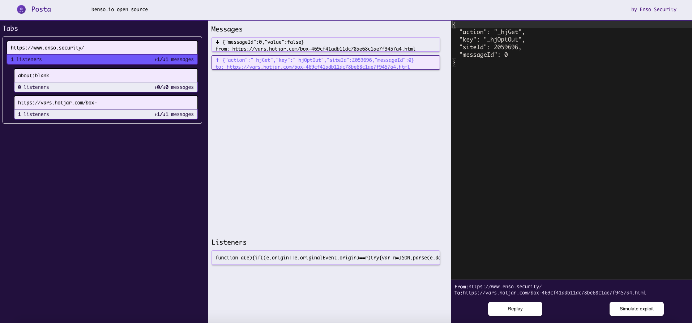
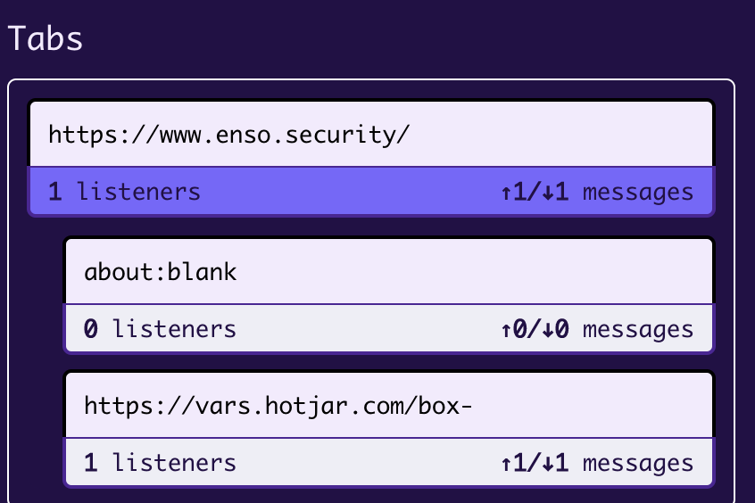
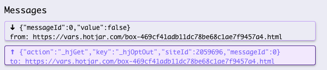
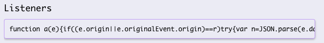
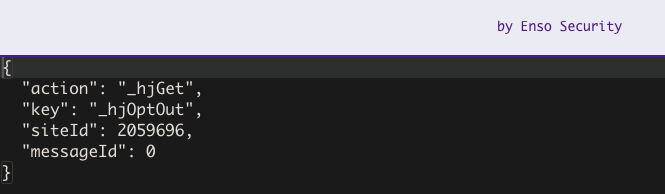
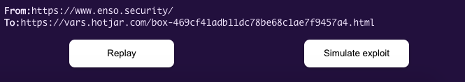
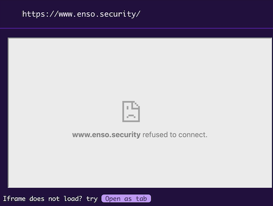

# Posta

<br /><p align="center"><a href="https://github.com/benso-io/posta" title="Posta"></a></p>

**Posta** is a tool for researching Cross-document Messaging communication. It allows you to track, explore and exploit `postMessage` vulnerabilities, and includes features such as replaying messages sent between windows within any attached browser.

<p align="center"></p>

## Prerequisites
* Google Chrome / Chromium
* [Node.js](https://nodejs.org/en/download/) (optional)

## Installation

### Development Environment

Run *Posta* in a full development environment with a dedicated browser (Chromium):

1. Install *Posta*
   ```bash
   git clone https://github.com/benso-io/posta
   cd posta
   npm install
   ```
1. Launch the dedicated Chromium session using the following command:
   ```bash
   node posta <URL>
   ```
1. Click on the Posta extension to navigate to the UI

### Chrome Extension

Run *Posta* as a Chrome / Chromium Extension:

1. Clone the repo:
   ```bash
   git clone https://github.com/benso-io/posta.git
   ```
1. Navigate to `chrome://extensions`
1. Make sure **Developer mode** is enabled
1. Click on **Load unpacked**
1. Choose the `chrome-extension` directory inside *Posta* and upload it to your browser
1. Load the extension
1. Pin the extension to your browser
1. Browse to the website you would like to examine
1. Click on the *Posta* extension to navigate to the UI

## Tabs
In the **Tabs** section we can find our main Origin, with the iframes it hosts and communicates with through the session.
We can choose the specific frame by clicking on it, and observe the postMessages related to that frame only.

<p align="center"></p>

## Messages
In the *Messages* section, we can inspect all `postMessage` traffic being sent from the origin to its iframes, and vice versa.
We can select specific communication for further examination by clicking on it.
The *Listeners* area presents the code which is in charge of handling the communication, we can click and copy its contents for JS code observation.

<p align="center">
</p>

## Console
In the console section, we can modify the original `postMessage` traffic, and replay the messages with the tampered values which will be sent from the Origin to its iframe.

We should make tests and see if we can affect the behavior of the website by changing the `postMessage` content. If we manage to do so, it's time to try and exploit if from a different Origin, by clicking "Simulate exploit".

<p align="center">
</p>


## Exploit

In the *Exploit* section, *Posta* will try and host the specified origin as an iframe in order to initiate `postMessage` communication. Most of the time we won't be able to do so, due to X-Frame-Options being enabled on the origin website.

Therefore, in order to continue with our exploitation, we'll need to gain communication reference with our Origin by initiating the `window.open` method, which can be achieved by clicking on **"Open as tab"**.

We have the console to our right which will help us modify and craft our specified payloads and test them in Cross-Origin Communication, initiated by clicking on the **Exploit** button.

<p align="center"></p>

# Authors
- Chen Gour Arie
- [Barak Tawily](https://quitten.github.io/)
- [Gal Nagli](https://github.com/NagliNagli)
- Omer Yaron
